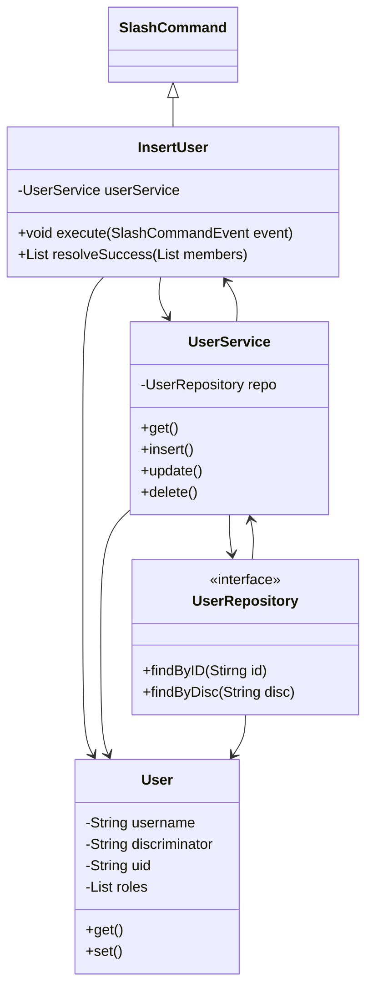

# JDA Discord SpringBoot project

This is a small Discord bot project that utilizes Java SpringBoot framework.

## MVC Architecture example:

- This, below, is a simple visualisation of the MVC architecture used in the project.

