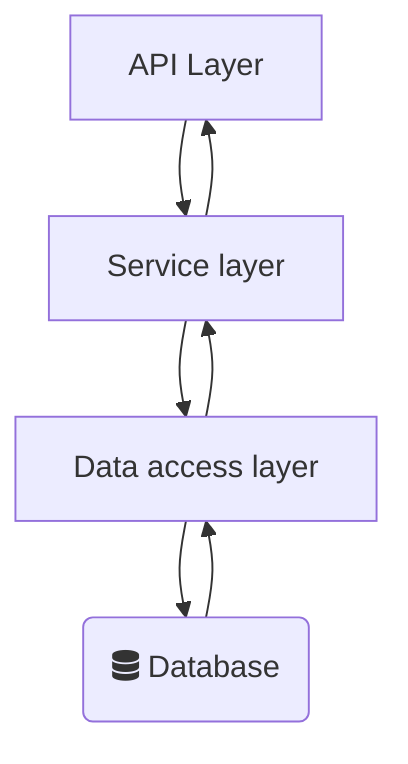

# Spring Boot practice

This is a small **Spring boot** practice project from a course.

### Project diagram:

```mermaid
    graph TD;
    A[API Layer] --> B[Service layer]
    B --> C[Data access layer]
    C --> DB(fa:fa-database Database)
    DB --> C
    C --> B
    B --> A
```
